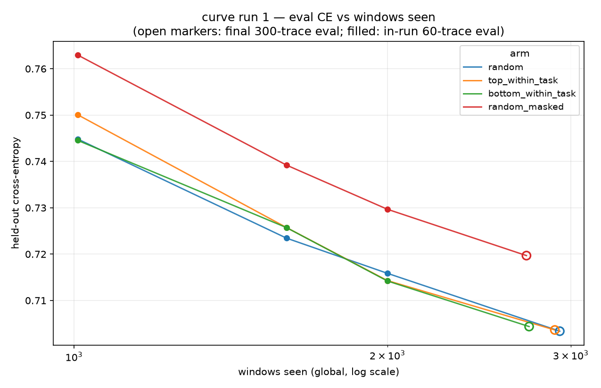

# curve run 1 — four-arm trace-selection SFT report

2026-09-18 · `experiments/curve` · all four arms completed (`stop_reason: stop_after_seconds`), no arm errored.
Kernels `evandekim/openswe-curve-{random,top-within-task,bottom-within-task,random-masked}`, manifests dataset
`evandekim/openswe-curve-manifests` (build `budget_chars: 165000000`, seed 0). Tables and the figure below are
produced by `uv run python scripts/curve_report.py` from `arms/<arm>/out/metrics.json` and
`data/manifests_summary.json`.

## ELI5

We taught a 1.5B coding model (Qwen2.5-Coder-1.5B) for 7 hours, four separate times, each on a different
hand-picked bundle of expert agent traces, and then tested each copy on 300 expert traces it had never seen.

- The four bundles: `random` (any labeled trace), `top_within_task` (only the trace that succeeded most often
  for each task), `bottom_within_task` (only the trace that failed most), `random_masked` (random's traces,
  but the loss is removed on repeated / errored / off-target steps).
- The score is held-out cross-entropy: how surprised the model is by the next token of an unseen expert trace.
  Lower = better student.
- Final scores: random **0.7034**, top 0.7036, bottom 0.7044, masked 0.7197.
- The best arm beat the control by 0.0003 — less than a fifth of the measured noise (0.0016). Picking the
  best sibling per task did nothing.
- Masking lost by 0.016 … but it also cut the training signal per step by ~45%, so it mostly lost because it
  trained on less, not because the removed steps were poison.
- All four score curves were still dropping fast at the end (~0.03 CE per doubling of data seen), and none had
  even finished one pass over its own training set.
- Takeaway: at this size and budget, *which* traces you pick doesn't matter — more data does. Train on traces
  uniformly; spend the effort on more data, not on selecting the best sibling.

## 1. Run config

Recipe for every arm (from `metrics.json`): Qwen2.5-Coder-1.5B-Instruct, fp16 LoRA r=16 α=32 dropout 0.05 on
all attn/MLP projections, plain transformers+peft (`backend: transformers`), DDP over 2×T4 (`nccl`,
`world_size: 2`), MAX_LEN 6144, GRAD_ACCUM 8 (16 windows/step global), lr 2e-4, AdamW clip 1.0, seed 0,
`max_sup_rows` 2048, stop guard `STOP_AFTER_SECONDS=25200` (7 h). Evals: `eval_heldout_small` (60 traces)
every 100 steps and at `windows_seen` milestones 1000/2000/3000; a final eval on all 300 traces
(`eval_heldout`) before the adapter is saved. Effective supervised tokens are `sum(labels != -100)`, so
masked steps in `random_masked` do not count as supervised.

### Run config

|  | traces (manifest) | tasks | supervised chars (M) | easy/hard/mid | steps_done | windows_seen | elapsed_s | total_elapsed_s | finished (UTC) | tok/s (global) | peak mem (GiB) | stop_reason |
|---|---|---|---|---|---|---|---|---|---|---|---|---|
| random | 3143 | 243 | 165.2 | 1106/556/1481 | 183 | 2928 | 25329 | 26043 | 2026-09-18T10:04:30Z | 622.6 | 11.5 | stop_after_seconds |
| top_within_task | 3366 | 934 | 165.3 | 1351/634/1381 | 181 | 2896 | 25263 | 26025 | 2026-09-18T10:03:50Z | 609.5 | 11.5 | stop_after_seconds |
| bottom_within_task | 3034 | 843 | 165.5 | 1213/578/1243 | 171 | 2736 | 25477 | 26142 | 2026-09-18T17:21:30Z | 579.7 | 11.5 | stop_after_seconds |
| random_masked | 3143 | 243 | 165.2 | 1106/556/1481 | 170 | 2720 | 25410 | 26081 | 2026-09-18T17:22:37Z | 576.2 | 11.5 | stop_after_seconds |

All arms are within 0.3% of the 165M supervised-char budget (ratios 1.001 / 1.002 / 1.003 / 1.001).
The budget is a *manifest* count, not what the run trains on: each trace contributes exactly one sampled
≤6144-token window per pass, so in 7 h the arms saw only 4.9 / 4.4 / 4.3 / 2.5 M supervised tokens
(§7), i.e. ~0.86–0.93 of a single pass over their own trace set.

### Traces per language

| arm | c | cpp | go | java | javascript | php | python | rust | typescript |
|---|---|---|---|---|---|---|---|---|---|
| random | 7 | 2 | 511 | 129 | 335 | 54 | 1523 | 170 | 412 |
| top_within_task | 3 | 2 | 541 | 136 | 352 | 82 | 1635 | 158 | 457 |
| bottom_within_task | 4 | 1 | 515 | 128 | 311 | 69 | 1471 | 139 | 396 |
| random_masked | 7 | 2 | 511 | 129 | 335 | 54 | 1523 | 170 | 412 |

### Traces per teacher

| arm | deepseek_v4_flash | minimax_m25 | qwen35_122b | qwen36_27b | qwen38_27b |
|---|---|---|---|---|---|
| random | 95 | 622 | 446 | 1349 | 631 |
| top_within_task | 0 | 952 | 770 | 737 | 907 |
| bottom_within_task | 0 | 867 | 700 | 651 | 816 |
| random_masked | 95 | 622 | 446 | 1349 | 631 |

Note the composition difference beyond the selection rule: `top_within_task` / `bottom_within_task` need a
labeled `p_resolved`, so they exclude the unlabeled `deepseek_v4_flash` traces and spread over ~3.5×
more tasks (934 / 843 vs 243) with one representative per `(harness, teacher)`.

## 2. Train loss (every 20 steps)

| step | random | top_within_task | bottom_within_task | random_masked |
|---|---|---|---|---|
| 20 | 0.9737 | 0.8880 | 0.9448 | 1.0433 |
| 40 | 1.2081 | 1.0513 | 0.8676 | 0.9889 |
| 60 | 0.7104 | 0.7071 | 1.2170 | 0.9118 |
| 80 | 0.6210 | 0.7937 | 0.7692 | 0.6303 |
| 100 | 0.7985 | 0.7481 | 0.8111 | 1.0952 |
| 120 | 0.9495 | 0.8282 | 0.7344 | 0.6601 |
| 140 | 0.7671 | 0.6998 | 0.7719 | 0.9679 |
| 160 | 0.8516 | 0.6366 | 0.8408 | 0.7527 |
| 180 | 0.7567 | 0.6162 | — | — |

The loss record is the mean over one rank's 8-micro-batch step, so it swings by ±0.3 step to step
(e.g. random 1.2081 → 0.7104 between steps 40 and 60); it is not a reliable curve on its own. The
`random_masked` loss is also not directly comparable — it is the mean over a different (smaller) set of
target positions. Eval CE (§3) is the metric to read.

## 3. Eval CE — every event, aligned by windows seen

Small-eval points are `eval_heldout_small` (60 fixed traces, 20 per bucket); `final_full` is the 300-trace
eval. Eval windows are seeded per trace id, so all four arms score the *same* windows of the *same* traces —
pairwise deltas at a shared event are paired comparisons on an identical eval set.

|  | event | windows_seen | random | top_within_task | bottom_within_task | random_masked |
|---|---|---|---|---|---|---|
| 0 | windows | 1008 | 0.74484 | 0.75009 | 0.74455 | 0.76297 |
| 1 | step | 1600 | 0.72345 | 0.72573 | 0.72572 | 0.73920 |
| 2 | windows | 2000 | 0.71586 | 0.71429 | 0.71420 | 0.72968 |
| 3 | final_full | 2928/2896/2736/2720 | 0.70337 | 0.70363 | 0.70437 | 0.71968 |

Only three in-run evals per arm exist: the 100-step cadence landed once (step 100 = 1600 windows) and the
1000/2000-window milestones fired; **the 3000-window milestone never fired** (runs stopped at 2720–2928
windows) and the final eval windows differ per arm (row 3's `windows_seen` is random/top/bottom/masked).



## 4. Final 300-trace CE and what the noise is

| arm | final CE (300 traces) | Δ vs random | windows at final | steps at final |
|---|---|---|---|---|
| random | **0.70337** | — | 2928 | 183 |
| top_within_task | 0.70363 | +0.00027 | 2896 | 181 |
| bottom_within_task | 0.70437 | +0.00100 | 2736 | 171 |
| random_masked | 0.71968 | +0.01631 | 2720 | 170 |

**No per-trace CE is recorded** — `metrics.json` stores only the mean CE per eval — so a bootstrap 95% CI
over the 300 eval traces cannot be computed from these files. What can be estimated is the noise scale from
the in-run series:

- Fit CE = a + b·ln(windows) per arm over its three 60-trace evals; the per-arm residual sd is
  0.0002–0.0015 (1 dof each — very rough).
- Pooling all four arms with one shared slope (4 intercepts + 1 slope, 12 points, 8 dof) gives a residual
  sd of **0.00157 CE**. This is the scale a pairwise CE difference has to beat to be readable at this
  run length.
- The spread among the three unmasked arms at matched windows is ≤0.0055 (1008 w) and ≤0.0023 (1600/2000 w).
- Because the eval traces *and* eval windows are identical across arms, eval-set sampling error cancels in
  the pairwise deltas; what remains is optimization/data-order variance, which is what the residual sd above
  captures. Without per-trace CE the absolute sampling error of a 60- or 300-trace mean is not estimable —
  future runs should log per-trace CE arrays to make this a real bootstrap.

Confound in the final row: random ran 192 more windows than bottom (worth ≈0.003 CE by the common slope of
§5). Adjusted for that, bottom's final CE is, if anything, ~0.002 *better* than random's — not worse.

## 5. Slope analysis — still descending at the stop

Per-arm fit of the in-run points to CE = a + b·ln(windows) (3 points each):

| arm | n_points | a | b_per_ln | drop_per_doubling | resid_sd |
|---|---|---|---|---|---|
| random | 3 | 1.0412 | -0.0429 | 0.0297 | 0.0015 |
| top_within_task | 3 | 1.1118 | -0.0523 | 0.0363 | 0.0002 |
| bottom_within_task | 3 | 1.0475 | -0.0438 | 0.0303 | 0.0013 |
| random_masked | 3 | 1.1017 | -0.0490 | 0.0340 | 0.0011 |

Pooled (shared slope): **b = −0.0470 per ln, i.e. −0.0326 CE per doubling** of windows seen.
Read as: at the operating point of this run (≈2.9k windows), every doubling of training data is worth about
0.03 nats of held-out CE. The last measured interval (1600→2000 windows, 0.32 doublings) still moved each
arm down 0.008–0.012 CE, so **more data was still clearly helping when the 7 h guard fired** — and no arm
had finished a single pass over its trace set (0.86–0.93 passes). Caveat: with 3 points per arm the slopes
are fragile (`b` varies −0.043…−0.052 across arms, a spread consistent with fit noise), so the pooled slope
is the number to carry forward.

## 6. Pairwise deltas and hypothesis verdicts

Δ (A − B) at each aligned eval event:

| pair | 1008 w | 1600 w | 2000 w | final 300 | verdict |
|---|---|---|---|---|---|
| top − random | +0.00524 | +0.00229 | −0.00157 | +0.00027 | no reliable effect (sign flips; ≤3.3× noise) |
| random − bottom | +0.00029 | −0.00227 | +0.00165 | −0.00100 | no reliable effect (≤1.5× noise; sign flips) |
| masked − random | +0.01813 | +0.01576 | +0.01382 | +0.01631 | consistent, 9–12× noise; masking hurts at matched windows |

Against the noise scale of 0.00157:

- **H1 — `top_within_task` beats `random` (selection improves the student): not supported.** The final
  deltas are +0.0003 across all windows, and −0.0003 (top marginally ahead) once random's extra 32 windows
  are discounted; in-run deltas run +0.005 → −0.002 and flip sign. Nothing here is distinguishable from
  noise.
- **H2 — `bottom_within_task` is worse than `random` (selection signal is real in the other direction):
  not supported.** Same picture, sign-flipping, ≤1.5× noise; and random's 192-window lead at the final
  (≈0.003 CE by §5) means if anything bottom looks slightly *better* once compute is equalized.
- **H3 — masking helps: rejected at matched windows, unresolved at matched dose.** `random_masked` trails
  by 0.014–0.018 CE at every matched event — an order of magnitude beyond the noise. But masking removes
  ~45% of the loss signal per window (§7), so this is a dose cut as much as a data-quality result; see §7
  for the dose-matched view before concluding anything about the masked steps themselves.

## 7. Supervised-token efficiency

Because the arms' windows carry different amounts of loss-bearing text, matched-window and matched-dose
rankings answer different questions. Doses are `sup_tok_per_s × elapsed_s × world_size` at the eval step
(cumulative-average estimate; final rows use the last 5-step log record, ≤2% low).

|  | arm | event | step | windows_seen | ce | sup_tokens_seen (M) |
|---|---|---|---|---|---|---|
| 0 | random | windows | 63 | 1008 | 0.74484 | 1.605 |
| 1 | random | step | 100 | 1600 | 0.72345 | 2.604 |
| 2 | random | windows | 125 | 2000 | 0.71586 | 3.243 |
| 3 | random | final_full | 183 | 2928 | 0.70337 | 4.886 |
| 4 | top_within_task | windows | 63 | 1008 | 0.75009 | 1.436 |
| 5 | top_within_task | step | 100 | 1600 | 0.72573 | 2.233 |
| 6 | top_within_task | windows | 125 | 2000 | 0.71429 | 2.815 |
| 7 | top_within_task | final_full | 181 | 2896 | 0.70363 | 4.449 |
| 8 | bottom_within_task | windows | 63 | 1008 | 0.74455 | 1.375 |
| 9 | bottom_within_task | step | 100 | 1600 | 0.72572 | 2.214 |
| 10 | bottom_within_task | windows | 125 | 2000 | 0.71420 | 2.876 |
| 11 | bottom_within_task | final_full | 171 | 2736 | 0.70437 | 4.316 |
| 12 | random_masked | windows | 63 | 1008 | 0.76297 | 0.852 |
| 13 | random_masked | step | 100 | 1600 | 0.73920 | 1.426 |
| 14 | random_masked | windows | 125 | 2000 | 0.72968 | 1.767 |
| 15 | random_masked | final_full | 170 | 2720 | 0.71968 | 2.482 |

Per-window supervised density (final dose / windows): random 1,669, top 1,536, bottom 1,577,
**masked 912** supervised tokens/window — masked trains on 55% of random's loss signal per window
(its running sup/token fraction is 16.9% vs random's 31.6%). This is the mechanism behind the masked gap:
the equal-char budget counts masked-out assistant text, so masking silently reduced the effective budget.

Log-linear interpolation to a common dose:

| matched dose | random | top | bottom | masked | masked − random |
|---|---|---|---|---|---|
| 2.0M supervised tokens | 0.73511 | 0.73181 | 0.72974 | 0.72603 | −0.00908 |
| 2.4M supervised tokens | 0.72706 | 0.72217 | 0.72217 | 0.72067 | −0.00639 |
| windows to reach 2.0M | 1242 | 1427 | 1449 | 2235 | 1.80× |

The ranking **inverts** when you switch the x-axis: at matched windows masked is worst by ~0.016; at matched
supervised tokens it is best by ~0.006–0.009, and the within-task arms edge out random. In other words, the
during-run CE differences across these arms track their *effective supervised dose* far more than their
selection rule. Two caveats before reading "masked is more efficient per token": (1) the arms reach a given
dose after different numbers of optimizer steps (masked needs 1.8× the windows/steps), so dose is confounded
with step count; (2) masked's dose counts only its own (cleaner, non-random) target subset, not the context
it still processed. The safe reading: **selection did not matter; dose did**, and the masked arm's deficit is
a dose deficit, not evidence that its removed steps were harmful.

## 8. Anomalies

- **`random_masked` silently dropped 68 traces (2.2%).** Encoding returns `None` when a sampled window
  contains no supervised (unmasked) assistant tokens: rank 0 dropped 24/1571, rank 1 44/1572 → 3075 of 3143
  traces encoded. The other three arms dropped 0. `metrics.json` reports `n_traces = len(examples) ×
  world_size` from rank 0, so it says 3094 — itself an over-count of the true 3075. The other arms encoded
  everything: random 1571 + 1572, top 1683 + 1683, bottom 1517 + 1517.
- **Milestone 3000 never evaluated.** Max windows_seen is 2928 (random); only 4 eval events per arm.
- **Final evals at unequal windows** (2720–2928) — a small confound, handled in §4/§6 via the slope.
- **No restarts, no NaNs, no rank divergence.** Each arm ran one kernel version and ended `COMPLETE`; no
  `metrics_error*.json` exists for any arm. Rank 0 and rank 1 records have identical `steps_done`,
  `windows_seen`, and eval CE at every event (DDP all-reduce works; per-rank speeds differ by a few %).
  `run_eval` all-reduces even for empty slices, and both ranks had non-empty local evals (30 small /
  150 final), so no eval ran on an empty slice.
- **Train loss is very noisy step-to-step** (8-micro-batch mean) — see §2; also not comparable across arms
  once masking changes the target set.
- Throughput (576–623 tok/s global) is below the v3 validation's 685 tok/s — expected: longer windows
  (avg 5.3–5.4k tokens vs 4.7k) and 3k-trace manifests; not an error. Peak memory 11.51 GiB on 2×T4, stable.
- The `n_traces` field for random also shows the rank-0 assumption (3142 vs 3143) — cosmetic.

## 9. Threats to validity

- **Small eval.** 60 traces in-run (1 CE number per arm per event), 300 final; no per-trace CE was stored,
  so no bootstrap CI. Composition: 100 per bucket; languages python 144 / go 49 / typescript 44 /
  javascript 30 / rust 16 / java 12 / php 5 of 300 — CE is python-dominated.
- **One seed, one run per arm.** No variance across seeds; the four arms also ran in two waves (random+top
  first, bottom+masked second) on the same recipe/hardware.
- **One model (1.5B), one recipe (fp16 LoRA r=16), ≤0.93 pass.** No arm completed an epoch of its own
  (fixed, single-window-per-trace) data, so this speaks to the under-trained regime only.
- **Equal chars ≠ equal tokens.** The budget proxy (chars/4) plus per-trace window sampling produced
  1,375–3,243 supervised tokens at matched events; §7 is the dose-corrected view, and the masked arm's
  effective budget was cut ~45% by construction.
- **One window per trace, fixed for the whole run.** A pass trains on a 5.3–5.4k-token window of each trace
  (traces average ~49–55k supervised chars in the manifests); the eval likewise scores one window per eval
  trace, so both train and eval CE measure next-token prediction inside sampled windows, not whole traces.
- **Mid-weighted task sampling** (mid 2×, hard/easy 1×) is shared by all arms, so it does not bias the
  comparison, but it does mean the result is about the mixed-difficulty slice of the corpus.
- **Composition differences beyond selection:** the within-task arms exclude unlabeled `deepseek_v4_flash`
  traces and cover ~3.5× more tasks; random includes 95 deepseek traces and repeats more tasks.
- **In-run evals are 60 traces but final is 300** — the last 60-trace reading sits ~0.012 above the final
  300-trace reading (different set *and* different windows, so this is not a level comparison); the pairwise
  deltas at shared events are the comparable part.

## 10. Next run recommendation

The centrepiece question (does trace selection move held-out CE at fixed budget?) is answered **no** at this
scale, and the computed next steps follow from that:

1. **Drop `top_within_task` / `bottom_within_task` from the next wave** unless/until the student is bigger.
   They cost half of a 30 h/week quota and moved CE by ≤0.001 (noise ≈0.0016). Keep `random` as the control
   in every wave.
2. **Run the dose-fixed masking test: `random` vs `random_masked` at matched loss-bearing tokens.** Fix the
   manifest budget for masked to count only unmasked chars (≈1.9× more traces for the same effective dose),
   or extend masked's wall-clock 1.8×. This isolates "is the masked target set better per token?" from
   "masking threw away half the signal".
3. **Spend the freed budget on data, not selection.** Two arms × 14 h (28 quota-h) gives ≈5.8k windows
   ≈1.9 passes at the measured rate; either that or sample K windows per trace so each pass covers more of
   the manifest. The pooled slope says a doubling is still worth ≈0.03 CE.
4. **Log per-trace CE arrays in `metrics.json`** for the final eval (and ideally the in-run evals) so the
   next report can produce a real bootstrap CI, and **record the true encoded-trace count per rank** rather
   than `len(examples) × world_size`.
5. Infrastructure nits for the next push: raise eval cadence to every 50 steps (a 7 h run only fired the
   100-step eval once), and consider dropping the 3000-window milestone or lowering it to 2500 so it can
   actually fire inside a 7 h session.
6. **Then move the arm to the model-size curve** (3B) with the control recipe — if selection is a no-op at
   1.5B, the interesting axis is scale × data volume, not trace ranking.

## Reproduce

```bash
uv run python scripts/curve_report.py                       # tables to stdout + the figure
uv run python scripts/curve_report.py --tables-out analytics/research/curve_run1_tables.md
uv run pytest tests/test_curve_report.py -q
```

Inputs: `experiments/curve/arms/<arm>/out/metrics.json` (+ `metrics_rank1.json`, `openswe-curve-*.log`)
and `experiments/curve/data/manifests_summary.json`. Figure: `analytics/research/figures/curve_run1_eval_ce.png`.
